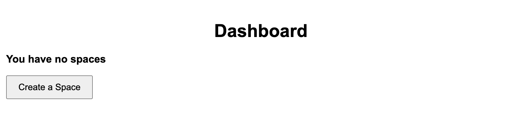

# SpaceWise

## Purpose:
This is a basic event management system built with PHP, Javascript, and a MySQL Database.

## Requirements:
- XAMPP

## Things to Improve:
- color differentiation
- user should be able to download their chart
- better GPT suggestions

- Improve the front end design of the site
- Users being able to add multiple events and have AI determine where they should go to avoid conflicts
- After adding a building or room, remove window pop-up message and instead display a table and update it every time something is added
- When a user searches for events, display the results in calendar form instead of a table
- Error handling. Don’t let user search or submit on empty/invalid input. 
- Display an “Upcoming events” calendar on the dashboard
- When a building or room is created, show a table of “Buildings added” or “Rooms added” instead of an alert message

## Demo

  

    
  

  

    
  

  

    
  

  

    &#10094;
    &#10095;
  

